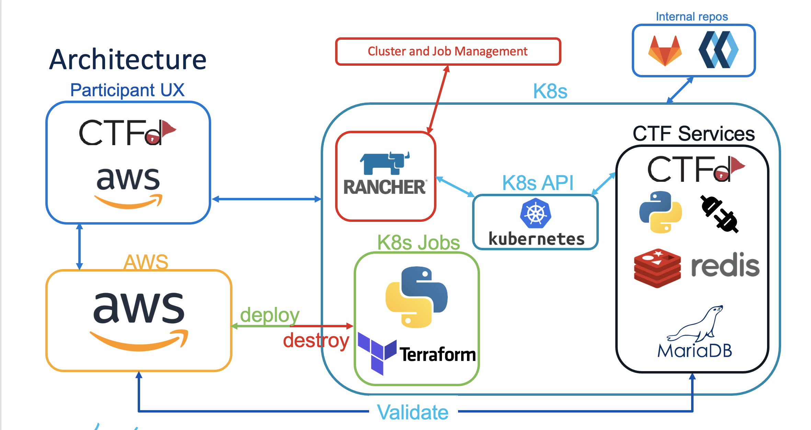

# CloudCTF
This repo is for building a cloud ctf based on AWS, leveraging the open source CTFd framework with a custom plugins.  

NOTE: This project was open sourced (internal to Cisco) and is still in the process of being documented for others to use. 
You are free to try the project today, but docs and refactoring for easier consumption are still in progress (with a low priority).

# Architecture

<p align="center">
    
</p>

# Container Registry
This is the custom ctfd image we will use for the competition which will be deployed in the k3s cluster:  
https://containers.cisco.com/repository/cloud-ctf/ctfd

# Local Development
This project is managed via Makefile. You can build and push ctfd image, as well as stand up a local instance of ctfd.

## Quick Start
Build ctfd container with custom code (plugins)
```bash
make build-ctfd
```

Run the container:
```bash
make run-ctfd
```

Navigate to http://localhost:8000 to setup your local ctfd instance.

If you make changes to your plugin code you need to restart services to pick up the changes in ctfd app:
```bash
make restart-ctfd
```

## Running ctfd locally

### Build the container
Build ctfd container with custom code (plugins)
```bash
make build-ctfd
```

### Start the container
```bash
make run-ctfd
```

This will start a docker container with ctfd and port 8000 exposed on localhost.
Go to http://localhost:8000 to access the web UI after running above command.

### Shell into the container
If you want to shell into the running container, run:
```bash
make shell-ctfd
``` 
which will drop you into the container at root of hte CTFd project (/opt/CTFd)

### Persistent DB for local dev
The database for local development is sqllite, and the file will be at `.data/ctfd.db`, 
which is linked into the running container at `/opt/CTFd/CTFd/ctfd.db`

### Add k8s config to test k8s jobs
Put your kube config file in location `.data/kube-config` if you want to test deploy/destroy k8s jobs.
The dockerfile will symlink this file to `/home/ctfd/.kube/config` so if it exists it will just work. 
When in production this file is passed in as a volume which will overwrite the symlink.

If you want to test k8s jobs locally, you need to create your own namespace in the cluster to stick the jobs and also create a PersistenVolumeClaim in the namespace with a name of "team-byoa-pvc". Once you have that, you need to re-run the ctfd local container and pass the `CTF_K8S_NAMESPACE` variable. for example:
```bash
make run-cftd CTF_K8S_NAMESPACE=my-namespace
```

Note that if you are doing this, you will not be able to access the terraform state locally as the terraform state will be stored in the cluster inside of a PersistentVolume.  
To test the deploy/destroy operations, just use the `bc` make commands, you will not be able to test 100% end-to-end locally for the deploy/destory/validate.
### Stop CTFd
```bash
make stop-ctfd
```

### Start CTFd (if already created)
If the container already exists and you ran `make stop-ctfd` and just want to start it again, just run:
```bash
make start-ctfd
```

You can also remove the container to stop services
```bash
make rm-ctfd
```

### Delete current app and start a new one
If you want to delete current data and make a new fresh ctfd application:
1. Remove the current container: `make rm-ctfd`
2. Remove the db file: `rm .data/ctfd.db`
3. Start the container again: `make run-ctfd`

The ctfd application UI should now take you through the ctfd set up.


# Building and pushing images
The ctfd container image just extends the default ctfd docker container image and then copies files into place as needed.
Primarily, this just copies plugins from this directory into `/opt/CTFd/CTFd/plugins/`

## Build image locally
To make a local image:
```bash
make build-ctfd
```

## Push image to container registry (containers.cisco.com)
To push up a new image run:
```bash
make push-ctfd
```
Note: this will build and then push, so you do not need to run the build command before running this.
Once you push a new version, you should make a tag for that version. by default this push will just push the image to the "manualtag" label. you should copy this to a v<version> label (i.e. v21 if last version was v20)


# Building BYOA Challenge job images

To build a challenge image job, i.e. by default it will be challenge1-deploy image:
```bash
make build-bc
```
This results in a build command as follows:  
```
docker build \
    -f Dockerfile.deploy_byoa_chal \
    -t cloud-ctf/challenge1-deploy:local \
    --build-arg CHALLENGE_REF_ARG=challenge1 \
    --build-arg RUN_SCRIPT_ARG=/opt/CloudCTF/deploy_byoa_chal.sh \
    --build-arg TF_BASE_DIR_ARG=/opt/CloudCTF/challenge1 \
    .
```
You can see how this is built, and you can override build variables as needed to the make command
```
CHALLENGE_REF_ARG ?= challenge1
BYOA_JOB_ACTION ?= deploy
IMAGE_NAME_BYOA_JOB = $(CHALLENGE_REF_ARG)-$(BYOA_JOB_ACTION)
CCC_PATH_BYOA_JOB ?= containers.cisco.com/$(NS)/$(IMAGE_NAME_BYOA_JOB)
BYOA_DOCKER_BUILD_FILE ?= Dockerfile.deploy_byoa_chal
RUN_SCRIPT_ARG ?= /opt/CloudCTF/deploy_byoa_chal.sh
TF_BASE_DIR_ARG ?= /opt/CloudCTF/$(CHALLENGE_REF_ARG)
```

For example, assuming challenge1 terraform base path is inside of the `vpc` dir,  
then we need to use a different path for `TF_BASE_DIR_ARG` docker build arg.  
We will run make command to achieve this:
```bash
make build-bc TF_BASE_DIR_ARG=/opt/CloudCTF/challenge1/vpc
```


## Builds for each challenge:

The challenges are all the same structure, so you only need to provide the `CHALLENGE_REF_ARG` and `BYOA_JOB_ACTION` variables.  
The only difference between the challenges is the `CHALLENGE_REF_ARG` so these steps are the same except you pass that challenge ref value you want to build. 
### Example challenge2
build challenge2 deploy image:
```bash
make build-bc CHALLENGE_REF_ARG=challenge2
```
Run the challenge2 deploy image:
```bash
make run-bc CHALLENGE_REF_ARG=challenge2
```
push challenge2 deploy image:
```bash
make push-bc CHALLENGE_REF_ARG=challenge2
```

build challenge2 destroy image:
```bash
make build-bc CHALLENGE_REF_ARG=challenge2 BYOA_JOB_ACTION=destroy
```
Run the challenge2 destroy image:
```bash
make run-bc CHALLENGE_REF_ARG=challenge2 BYOA_JOB_ACTION=destroy
```
push the challenge2 destroy image:
```bash
make push-bc CHALLENGE_REF_ARG=challenge2 BYOA_JOB_ACTION=destroy
```

This assumes the terraform root directory is the `challenge#` directory. if for some reason you want to change this (not recommended) you can add the `TF_BASE_DIR_ARG` arg at build time:
```bash
make build-bc TF_BASE_DIR_ARG=/opt/CloudCTF/challenge1/vpc
```

# App Architecture

## Deploy code
### Terraform code
Challenge code that uses terraform place into a "challenge#" directory at the root of the project. i.e. `challenge1`
Put terraform files at the root level of this repo. This is where the `terraform` commands will be run from (i.e. `terraform init)

### Running and Testing Terraform
When developing and testing locally, use the `make build-bc CHALLENGE_REF_ARG=challenge1` command to build your container for deploying terraform.   
Then run `make run-bc CHALLENGE_REF_ARG=challenge1` to run the deploy job.

This will build the deploy job container, to push it run `make push-bc CHALLENGE_REF_ARG=challenge1` to push up a new version. (remember to go move the tag to latest after verifying)

To build/run/push the destroy job container, it is the same process as deploy, you just need to override the default job type using the `BYOA_JOB_ACTION` variable. Example:

```bash
make build-bc CHALLENGE_REF_ARG=challenge1 BYOA_JOB_ACTION=destroy
make run-bc CHALLENGE_REF_ARG=challenge1 BYOA_JOB_ACTION=destroy
make push-bc CHALLENGE_REF_ARG=challenge1 BYOA_JOB_ACTION=destroy
```

### Terraform state backend
Because S3 with cross account is a bit annoying to manage on short notice, we are using local backend for terraform.  
The file location when inside of the container will always be the same, and this should be provided in your providers.ts file as follows:
```terraform
provider "aws" {
  access_key = var.AWS_ACCESS_KEY_ID
  secret_key = var.AWS_SECRET_ACCESS_KEY
  region     = var.AWS_REGION
}

terraform {
    backend "local" {
        path = "/var/data/terraform/terraform.tfstate"
    }
}
```
Make sure this is what your provider.ts file looks like.  
When running with `make run-bc` locally, it will link the tfstate directory into `.data/challenge#`.
So locally the tfstate file would be at (relative to root of repo) assuming challenge1: `.data/challenge1/terraform.tfstate` 
which would be linked into `/var/data/terraform/terraform.tfstate` inside of the container (it maps `.data/challenge1:/var/data/terraform`)


#### K8S Runs
When these containers run in K8S we still need to store the state persistently. 
Inside the container the path does not change, but we will link in a PV to this path so it persists after the container exits.

In K8S we will use a pvc called `team-byoa-pvc`. for dev, you need to make this pvc in whatever namespace you are using for dev.  
sub pathing will be used for each team/challenge, so when the PV is used in the jobs it will use sub_path `team#/challenge#` inside of this pvc.  

#### Accessing tfstate from ctfd
For validation we will also want to be able to check the tfstate file to look up things like public ip, etc.  
This will be accessible at path `/var/data/team-byoa-pvc` from cttd app (i.e. your plugin code can read from this to look up tfstate for a given team/challenge).  
example: to lookup the tfstate for challenge1 for team1, the path would be `/var/data/team-byoa-pvc/team1/challenge1/terraform.tfstate`
