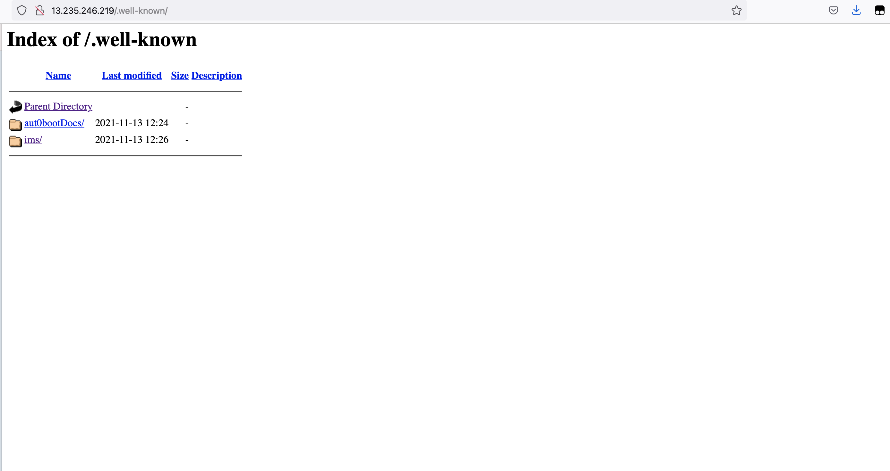

## This is a Offense challenge for challenge 1 which is built. The challenge is exaclty similar to challenge 1 where the only differece is that they do not need to fix any nacl and only need to get the flag which is hidden under ./well-known directory 

The http application gives a html verdict as below 

This is the secure page where only few can access . Below is the secure conversation 
            asd272727: where is the secure doc?
            bgsgsgsgsg: I think only admin can access it
            rfc5785 : I think super admin can access it
            john78567: I cannot find it
            bh76363636: Tell us

The rfc5785 talks abt a secret ./well-known method being hidden in the application . The flag is hidden inside the path.
   

    

# External 

## Question in challenge

## Challenge name : Secure Application

## Challenge Description : 
Company Venezula has came up with secure application. Could you find something suspicious?

