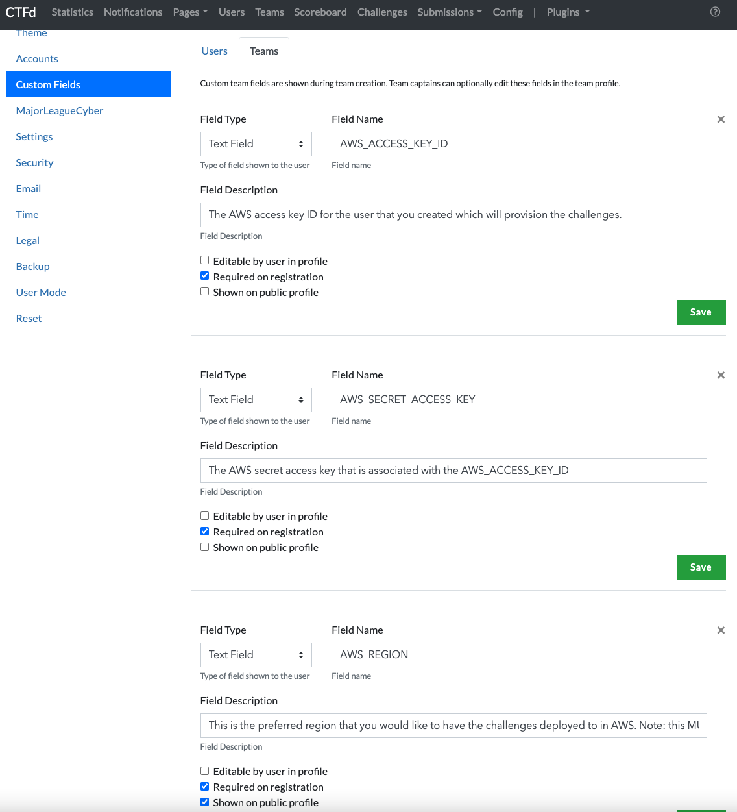
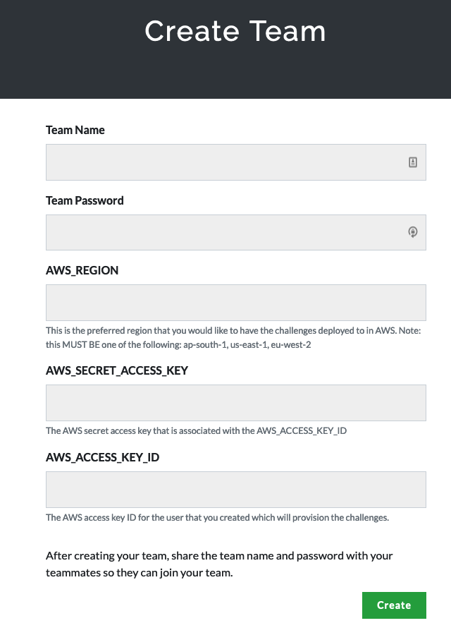

add# CTFd Application setup
Steps for setting up the CTFd application once you have it deployed on K8s.

## Initial CTFD setup
Navigate to the CTF web application, it should be redirecting you to the setup page at this point.  
Pick an event name and add a description and make sure to choose `Team Mode` as the mode.  
Continue through the rest of the options, choosing whatever settings you want.

## Add Custom Fields for AWS account info
When a team registers for the CTF, you need them to provide their AWS information. To do this, the custom fields for teams were added.
You need to add the following 3 custom fields under the team custom fields in the CTFd config:  

`AWS_ACCESS_KEY_ID` - The AWS access key ID for the user that you created which will provision the challenges.    
`AWS_SECRET_ACCESS_KEY` - The AWS secret access key that is associated with the AWS_ACCESS_KEY_ID  
`AWS_REGION` - This is the preferred region that you would like to have the challenges deployed to in AWS. Note: this MUST BE one of the following: ap-south-1, us-east-1, eu-west-2

Example screenshot of the config:
  

***! Important Security Note !***   
From an application perspective, these are handled as text fields and not as "secure strings" with the current implementation, so this is not ideal for passing and handling cloud credentials.
They will only be encrypted at transfer if you are using HTTPS, and they are stored as text fields in the database so they are not encrypted at rest.
Please keep this in mind if you are setting up your own CTF and be cautious where the database storage for mysql is residing. 
This CTF was only ever used/designed as an internal CTF where the participants trust the organizers of the CTF to handle their AWS credentials responsibly.
It would not be recommended to host a "public" event without refactoring this part of the application to be more secure to handle these type of credentials.

## Create Team Example
Once you've added the custom team fields people will see these required fields when they go to register a team.  
  
